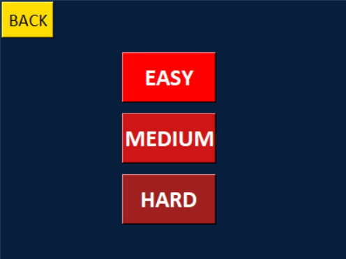
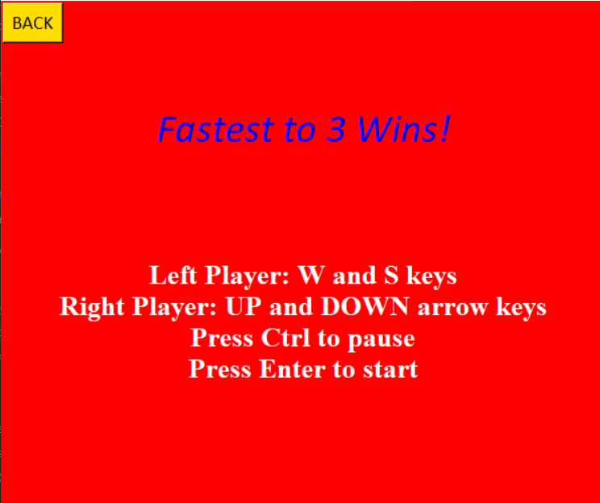
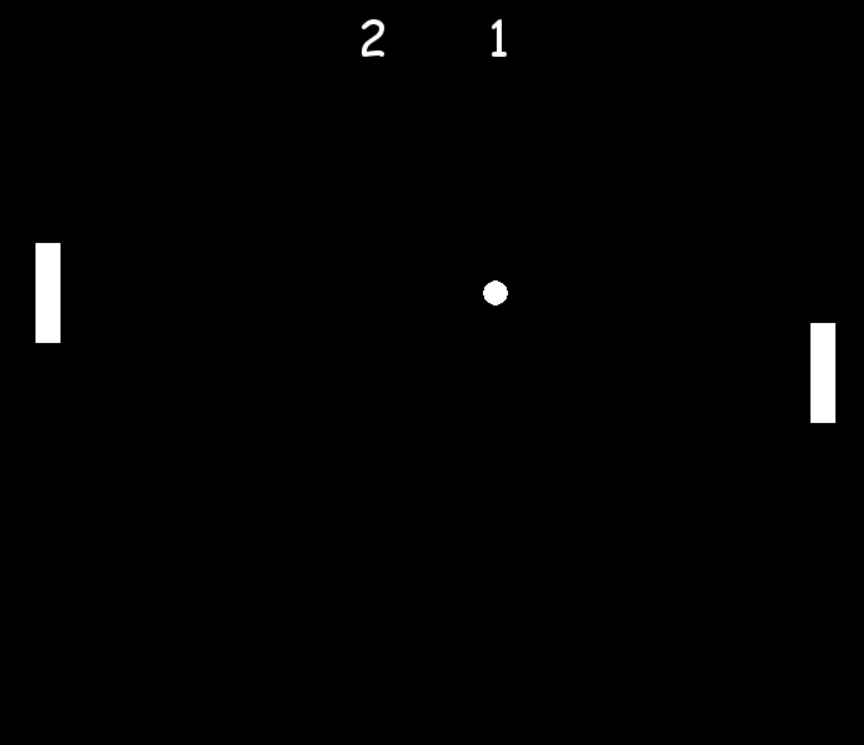
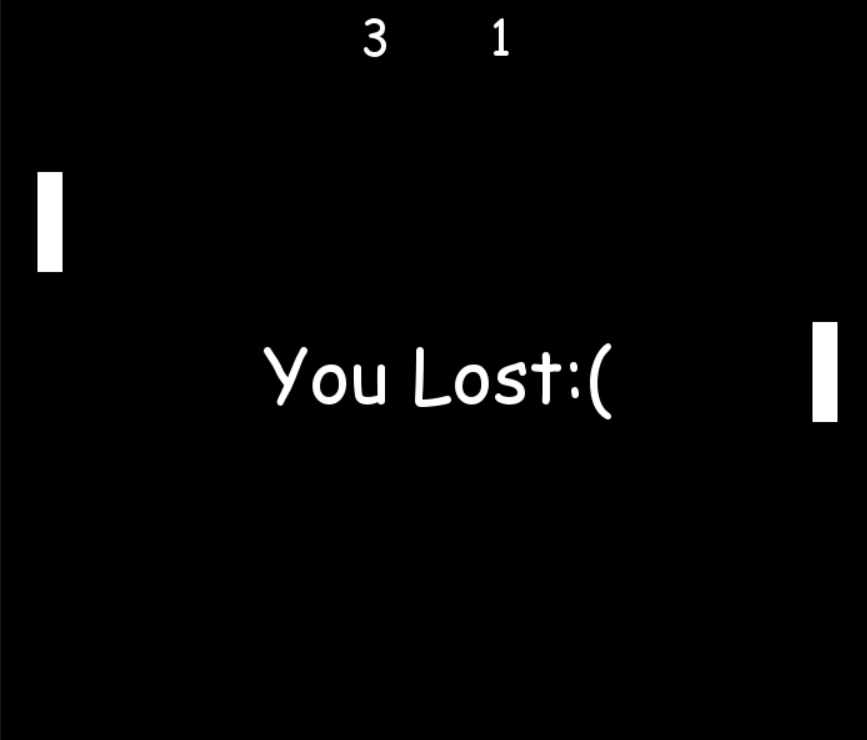
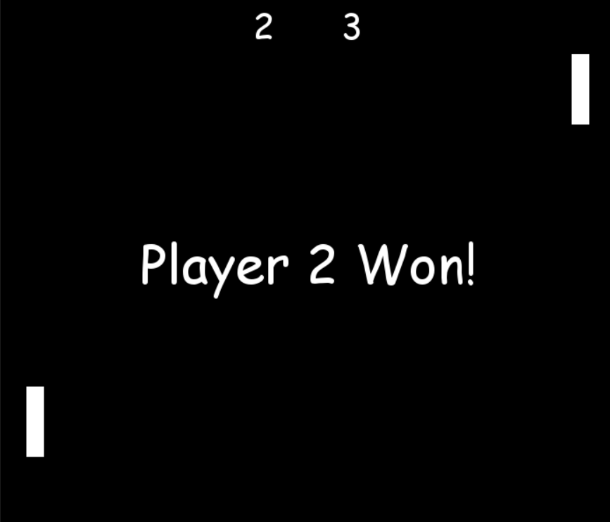

# TheClassicPong
The user interface for the game is made using the Tkinter module, and the main game is created using the Pygame module.

Clone this repository using
```
git clone https://github.com/ThrivikramanV/TheClassicPong
```
To play the game, run the following command
```
python GUI.pyw
```
### GAME VIEW!
---
 
 
 
